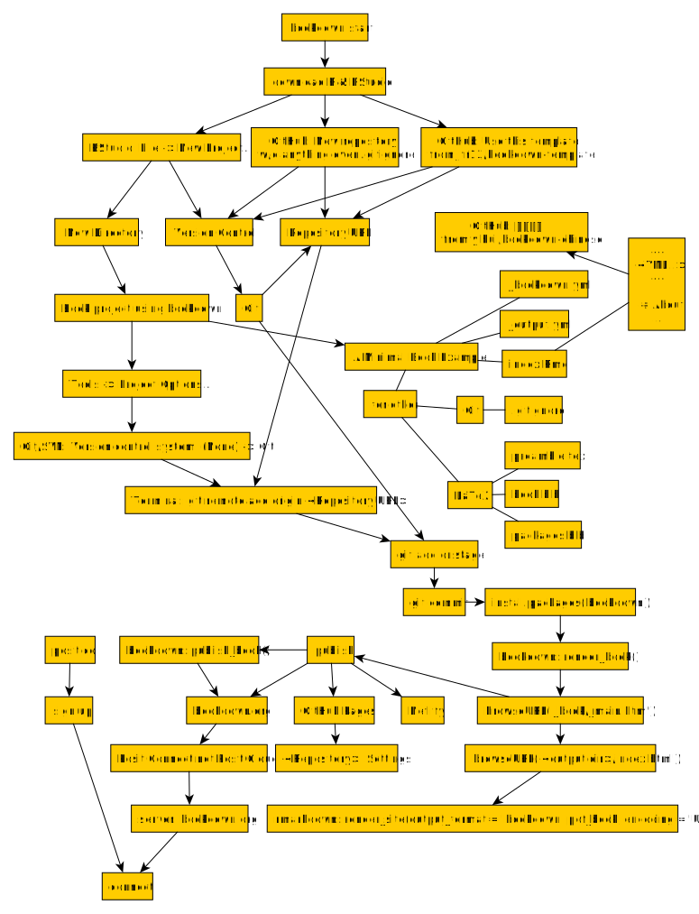

--- 
title: "My Bookdown Template"
author: "Joey Yu Hsu"
date: "`r Sys.Date()`"
site: bookdown::bookdown_site
documentclass: book
bibliography: [book.bib, packages.bib]
# url: your book url like https://bookdown.org/yihui/bookdown
# cover-image: path to the social sharing image like images/cover.jpg
description: |
  This is a minimal template of using the bookdown package to write a book.
  The HTML output format for this template is bookdown::gitbook,
  set in the _output.yml file.
link-citations: yes
github-repo: n/a
---

# workflow to start bookdown {-}



## create bookdown project

To create a bookdown project in RStudio, you can follow these steps:

1. Open RStudio.
2. Go to "File" in the top menu.
3. Select "New Project..." from the drop-down menu. This will open the "New Project" dialog.
4. In the "New Project" dialog, select "New Directory".
5. Choose "Book project using bookdown" from the list of project templates.
6. Specify the directory where you want to create the bookdown project by entering the project name or clicking on the "Browse" button to select a directory.
7. Click on "Create Project" to create the bookdown project.

RStudio will create the project with the necessary files and folders for a bookdown project structure.

You can start adding your book content in the `.Rmd` files within the project. The main book file is typically named `index.Rmd`, and you can include additional chapters or sections as separate `.Rmd` files.

To compile and render your book, you can use the `bookdown::render_book()` function or the "Build Book" button in the RStudio toolbar. The rendered output files, such as HTML or PDF, will be saved in the `_book` directory by default.

Remember to install the `bookdown` package if you haven't already by running `install.packages("bookdown")` in the R console.

## necessary files in a bookdown project structure

```
<bookdown_project_root>/
├── _bookdown.yml
├── _output.yml
├── index.Rmd
├── preamble.tex
├── book.bib
├── packages.bib
├── ...
```
In a typical bookdown project structure, the necessary files and folders include:

1. `_bookdown.yml`: This file contains the configuration options for your bookdown project. It allows you to specify various settings such as the output format, file naming conventions, and other project-specific options.

2. `_output.yml`: This file specifies the output format settings for your book, such as HTML, PDF, or EPUB. It allows you to customize the appearance and behavior of the rendered output.

3. `index.Rmd`: This is the main book file that contains the content and structure of your book. It typically serves as the entry point for your book and can include chapter headings, sections, and content in Markdown or R Markdown format.

4. `preamble.tex`: This file contains LaTeX code that is included at the beginning of the LaTeX/PDF output. It can be used to define custom LaTeX commands or include additional LaTeX packages.

5. `book.bib`: This file is an optional BibTeX bibliography file that can be used to manage references for your book. It stores the bibliographic information for the references cited in your book.

6. `packages.bib`: This file is also an optional BibTeX file that specifies the LaTeX packages to be used in the LaTeX/PDF output. It allows you to include additional LaTeX packages that are not automatically loaded by bookdown.

These files and folders provide the necessary structure and configuration for your bookdown project. You can customize and modify them based on your specific requirements and preferences.

In addition to the previously mentioned files, here are some additional files commonly found in a bookdown project:

```
<bookdown_project_root>/
├── ...
├── <bookdown_project_name>.Rproj
├── README.md
├── style.css
├── .gitignore
├── ...
```

- `<bookdown_project_name>.Rproj`: This file is the RStudio project file for your bookdown project. It allows you to open the project in RStudio with all the associated files and settings.

- `README.md`: This file is a markdown file that typically serves as the project's README. It can include an introduction, project description, installation instructions, or any other relevant information about the bookdown project.

- `style.css`: This file contains custom CSS styles that can be applied to the rendered output of your book. You can use this file to customize the appearance and layout of the HTML output, such as changing fonts, colors, or adding custom styles.

- `.gitignore`: After git initializing, this file specifies which files and directories should be ignored by Git version control. It allows you to exclude certain files or folders from being tracked in your version control system, such as temporary files, output files, or sensitive data.

These additional files enhance the functionality and organization of your bookdown project. They provide project-specific information, custom styling options, and version control management.

After rendering your book using bookdown (`bookdown::render_book()` in Console tab in the left lower pane of RStudio), the resulting output files are typically stored in the `_book` directory showing in the Files tab in the right lower pane of RStudio. Here's an updated directory structure:

```
<bookdown_project_root>/
├── _book/
│   ├── ...
│   ├── index.html
│   ├── <chapter1>.html
│   ├── <chapter2>.html
│   ├── style.css
│   └── ...
├── ...
```

In the `_book` directory, you will find various files related to the rendered book, such as `index.html`, `<chapter1>.html`, `<chapter2>.html`, and so on. These HTML files correspond to the different chapters or sections in your book. The `style.css` file is also present in the `_book` directory, containing any custom CSS styles you may have specified.

The `_book` directory holds the complete rendered version of your book, ready for distribution or publishing. You can open the `index.html` file in a web browser to view the book's main page and navigate through the chapters using the generated HTML files.

Please note that the specific file names and structure may vary depending on your book's content and configuration.

## book rendering

If you don't set the `output_dir` in the `_bookdown.yml` file, the `bookdown::render_book()` function will use the default output directory, which is `_book`. This means that the rendered book will be generated in the `_book` directory located in the root directory of your bookdown project.

To render your book without specifying the output directory explicitly, you can simply call `bookdown::render_book()` without any additional arguments:

```R
bookdown::render_book()
```

By default, this will render your book and save the output files, such as HTML, PDF, or other formats, in the `_book` directory.

It's important to ensure that the `_book` directory is not being used for any other purpose, as bookdown will generate and overwrite files in that directory during the rendering process.

If you don't set the `output_dir` in the `_bookdown.yml` file, the default output directory for your bookdown project will be the `_book` directory. The `_book` directory is created automatically by bookdown and contains the compiled output of your book, including HTML, PDF, or other formats you have specified.

By default, bookdown will create the `_book` directory in the root directory of your bookdown project. However, if you have a custom directory structure or want to specify a different output directory, you can set the `output_dir` option in the `_bookdown.yml` file to specify the desired output directory.

For example, if you want the output to be generated in a directory named `my_output`, you can add the following line to the `_bookdown.yml` file:

```yaml
output_dir: my_output
```

This will create the `my_output` directory in the root directory of your bookdown project and generate the output files inside it.

Remember to make sure that the specified output directory is not already used for any other purpose, as bookdown will generate and overwrite files in that directory during the build process.

If you have not set the `output_dir` in the `_bookdown.yml` file and your bookdown project does not have any first-level headings, you can use the following code to open the main HTML file in a web browser:

```R
browseURL('_book/_main.html')
```

The `_main.html` file is the main HTML file generated by bookdown when there are no first-level headings, i.e. `# chapter ...`, in your project.

However, if your bookdown project does have at least one first-level heading, you can use the following code to open the main HTML file in a web browser:

```R
browseURL('_book/index.html')
```

In this case, the main HTML file generated by bookdown is typically named `index.html` and is located in the `_book` directory.

Please note that the code assumes you are running it in an R environment that has the `browseURL()` function available, and the `_book` directory has been successfully generated by bookdown before attempting to open the HTML file.

## version control

* To add an existing R project to GitHub, you can follow these steps:

1. Create a new repository on GitHub without initializing it with a README, .gitignore, or license.
2. Copy the repository URL provided by GitHub.

In RStudio:

3. Open your R project.
4. Go to "Tools" in the top menu and select "Project Options...".
5. In the "Project Options" dialog, click on "Git/SVN" in the left sidebar.
6. In the "Version control system" dropdown, select "Git".
7. Click on "OK" to close the dialog. This may  restart your RStudio.
8. Open the Git tab in the upper right pane.
9. In the Git tab, click on "More" and select "Terminal".
10. In the Terminal pane, run the following commands, replacing `<repository_url>` with the repository URL copied from GitHub:

```
git remote add origin <repository_url>

```

```
git branch -M main
```

11. In the Git tab (typically located in the upper right pane), you should see a list of "Pending Changes" with checkboxes next to each file.
12. To stage all the files for commit, please select all files, this will mark all the files for inclusion in the commit.
13. Enter a commit message in the "Commit Message" field to describe the changes you're making.
14. Click on the "Commit" button to commit the staged changes.

Once you have committed your changes, you can proceed with pushing them to the GitHub repository:

15. In the Git tab, click on the "Push" button. This will push the committed changes to the remote repository.

Or in the terminal

```
git push -u origin main
```

You may be prompted to provide your GitHub credentials if this is your first time pushing to the repository. Enter your username and password or personal access token when prompted.

After completing these steps, your changes will be pushed to the GitHub repository, making them available to others who have access to the repository.


This will add the remote repository as the origin, switch to the main branch (if not already on it), and push your project to GitHub.

* To create a new R project using version control, you can follow these steps:

1. Open RStudio.
2. Go to "File" in the top menu and select "New Project...".
3. In the "Create Project" dialog, select "Version Control" and choose the version control system you want to use (e.g., Git).
4. Specify the repository URL or directory for the project.
5. Click on "Create Project" to create the R project with version control integrated.

RStudio will initialize the project with the chosen version control system and set up the necessary files and folders for version control management.

Please note that these instructions assume you have Git installed and properly configured on your system. Additionally, make sure you have the necessary permissions to create repositories on GitHub or access the desired repository.

## publishing

## R markdown